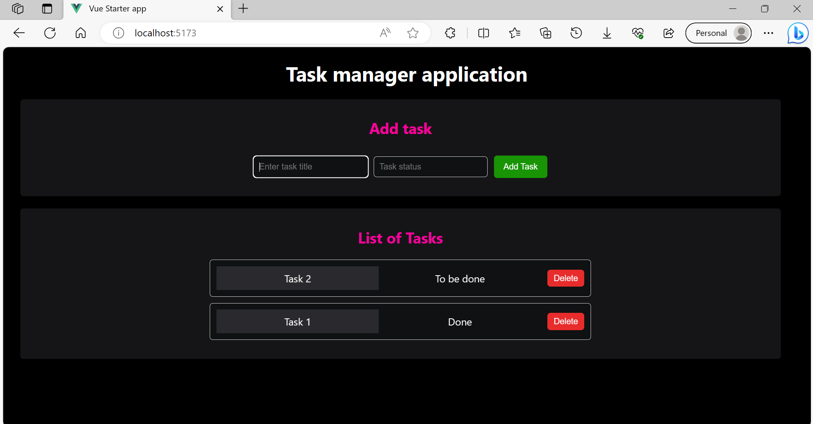

# vue-starter-application

This SurrealDB Starter Kit for Vue.js is a simple task manager application that allows you to manage tasks using SurrealDB as the database backend. The starter kit should help you get started with building applications using Vue.js and SurrealDB.

## Features

- Create, read, and delete tasks in a SurrealDB table.
- Error handling for database interactions.
- Parameterized queries to prevent SQL injection.

## Prerequisites

Before you begin, ensure you have met the following requirements:

- Node.js: Make sure you have Node.js installed on your system. You can download it from [here](https://nodejs.org/en/download/).

## Developing using the starter kit

1. Clone this repository
    ```sh
    git clone https://github.com/inkollusireeshaadharani/vue-starter-kit.git
    ```

1. Navigate to the project directory
    ```sh
    cd vue-starter-kit
    ```

1. Install Dependencies
    ```sh
    npm install
    ```

1. Configure SurrealDB connection: Open the **src/db/surreal.js** file and configure the connection settings for SurrealDB. You may need to update the database URL and credentials.

1. Get SurrealDB up and running using Docker
    ```sh
    docker compose up -d
    ```
    > Note: You can also install SurrealDB on your machine. For more information, check out [SurrealDB installation](https://surrealdb.com/install).

1. Run the project in development mode
    ```sh
    npm run dev
    ```

1. Access the application in your web browser at http://localhost:5173.

1. Do not forget to shut down SurrealDB when you are done.
    ```sh
    docker compose down
    ```

## Usage

- Create a task: Enter a task name along with its status and click the **Add Task** button.
- Delete a task: Click the **Delete** button next to the task you want to delete.
- View the list of tasks: All the tasks are available under the **List of Tasks** section.

## Screenshot



## Contributing to this repository

If you have any questions or suggestions, please feel free to open an issue or a pull request.  
Learn more about SurrealDB here: https://surrealdb.com